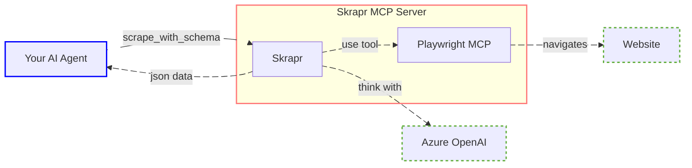

# Skrapr - MCP Server

🎉 Cloud version available! [Fill this form](https://airtable.com/appjnzD8em5Eg1ljz/pag4KfNxEaeFp1s8l/form) to get access.

Skrapr is an **intelligent web scraping tool** that combines AI capabilities with browser automation to extract structured data from websites.

In short:

    website url + JSON schema = structured website data

This tool is an alternative between http request tool (dump) and scraper tools (brute force).

## How it works



## Available tools

- **scrape_with_schema** : 
    - Title: Extract data from a website based on a JSON schema
    - Description: Navigate and scrape the given website to extract data matching the structure of the provided JSON Schema.
    - Parameters: 
        - **url**: The URL of the website to extract data from.
        - **jsonSchema**: The JSON Schema describing the data structure to extract.
        - **instruction**: Optional instructions to guide how the scraping should be performed.
    - Read-only: true

## Example

Once configured, you can use Skrapr's capabilities directly in any MCP client ([Claude Desktop](https://claude.ai/desktop), [n8n](https://n8n.io/), [librechat](https://librechat.ai/), ...).

For example, you can ask Claude:

    Extract product information from all categories at https://example.com/products.
    I want name, description and price for each product.

The model with create a similar schema and pass it to Skrapr :

```json
{
    "type":"object",
    "properties":{
        "products":{
            "type":"array",
            "items":{
                "type":"object",
                "properties":{
                    "name":{
                        "type":"string"
                    },
                    "price":{
                        "type":"string"
                    },
                    "description":{
                        "type":"string"
                    }
                }
            }
        }
    }
}
```

Scrapr will navigate the website, page by page, until it has found all the data it needs.

After scraping, you will receive the following response :

```json
{
    "products": [
        {
            "name": "Product 1",
            "price": "10",
            "description": "Description of product 1"
        },
        {
            "name": "Product 2",
            "price": "20",
            "description": "Description of product 2"
        }
    ]
}
```

## Getting Started with MCP Host

For a typical MCP Host integration (Claude Desktop), here's how to set it up:

### With .NET:

```json
{
  "mcpServers": {
    "skrapr": {
      "command": "dotnet",
      "args": [
        "run",
        "--project",
        "path/to/Skrapr/Skrapr.csproj"
        "-e", "AzureOpenAi__ApiKey=your-api-key", 
        "-e", "AzureOpenAi__Endpoint=https://your-resource.openai.azure.com/", 
        "-e", "AzureOpenAi__DeploymentName=your-deployment-name", 
        "-e", "PlaywrightMcp__IsLocal=true", 
      ]
    }
  }
}
```

### With Docker:

1. Build the Docker image:
    ```bash
    docker build -t skrapr .
    ```

2. Run the container:
   ```bash
   docker run \
        -p 80:80 \
        -e AzureOpenAi__ApiKey=your-api-key \
        -e AzureOpenAi__Endpoint=https://your-resource.openai.azure.com/ \
        -e AzureOpenAi__DeploymentName=your-deployment-name \
        -e PlaywrightMcp__IsLocal=true \
        skrapr
   ```

3. The MCP server will be available at `http://localhost:5000`.

4. You can configure your MCP Host
    ```json
    {
      "mcpServers": {
        "skrapr": {
          "url": "http://localhost:5000/sse"
        }
      }
    }
    ```

### With Cloud version

I am hosting a Skrapr instance on Cloud with everything configured.

If you are interested to try it out, [reach me here](https://airtable.com/appjnzD8em5Eg1ljz/pag4KfNxEaeFp1s8l/form) to get access to the beta.

```json
    {
      "mcpServers": {
        "skrapr": {
          "url": "https://[ask-for-url]/sse"
        }
      }
    }
```

## Playwright configuration

Playwright can be executed locally or remotely.

### Local

Setting environment variable `PlaywrightMcp__IsLocal=true` will make Playwright run locally.

You need to have Node.js installed to make it work.

It uses `npx @playwright/mcp` to run Playwright.

### Remote

Setting environment variable `PlaywrightMcp__Endpoint` will use Playwright on a remote host.

## Under the hood?

### AI Agent

Skrapr uses an AI agent internally aiming to :
- Understand website structure and content
- Autonomously navigate across the website
- Make strategic navigation decisions to locate the requested information
- Produce a structured JSON result based on a provided JSON schema.

### Technical stack

It uses:
- [Microsoft's Semantic Kernel](https://github.com/microsoft/semantic-kernel) to build the agent 
- [Playwright MCP](https://github.com/microsoft/playwright-mcp) to expose tools for websites navigation
- [Azure OpenAI](https://azure.microsoft.com/en-us/products/cognitive-services/openai-api/) for AI capabilities and data extraction according to user-defined JSON schemas

Thanks to MCP ([Model Context Protocol](https://modelcontextprotocol.org/)), you can connect Skrapr to any agent whatever the language.

## Why Skrapr?

When building a AI Agent, you may want the agent to extract easily information from websites.

Currently, ai models can't navigate websites natively.

Simple HTTP Request tools exist however there is few limitations :

- No javascript execution: cannot read dynamic content
- Information may not be present in the loaded page, but in a subpage

Scraper tools are also exists, but they :
- Load to much information (randomly scrape)
- Takes to much time to scrape
